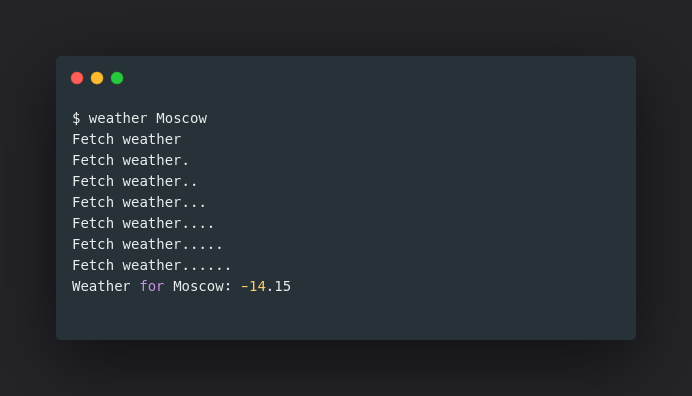

# WeatherCLIBlocPython
[](https://www.travis-ci.com/pen-lab/WeatherCLIBlocPython)

Пример использования [pythonBloc](https://github.com/pen-lab/python-bloc)




```bash
poetry env use path-to-python3.9
porty install 
```


